<div align="center">
  <br />
  
  <h1>🚦 Traffic Dashboard <strong>SOC</strong></h1>
  <p><strong>Next-Generation Traffic Intelligence & Automated Enforcement System</strong></p>

  <p>
    
    
    
    
  </p>
</div>

<br />

> [!NOTE]
> **Mission Statement:** To eliminate traffic fatalities and streamline urban mobility by converting blind surveillance networks into proactive, AI-driven intelligent dispatch systems.

## 📡 What is Traffic Dashboard?
Traffic Dashboard is a cloud-native **Security Operations Center (SOC)** Dashboard. It aggregates live RTSP/CCTV streams from geographical junctions, analyzes the frames via an independent AI microservice, and pushes real-time infractions (Speeding, Helmetless riding, Illegal lane changes) to a centralized command unit.

---

## 🏆 Core Capabilities

| Capability | Description | Technical Implementation |
|:---|:---|:---|
| **🌍 Dynamic Feed Aggregation** | Connect 1,000+ CCTV nodes grouped by global locations. | H.264 Web Embeds with zero-latency CSS DOM switching. |
| **🏎️ Automated Violation Logging** | AI-detected infractions are journaled automatically. | Decoupled Jobs & Redis Queues prevent HTTP blocking. |
| **📱 Fleet Connect API** | Live sync with mobile traffic enforcement unities. | Tokenized `GET` & `POST` RESTful Endpoints. |
| **⚡ Enterprise SOC Viewer** | Expands complex traffic junctions with live system HUDs. | Alpine.js modal injection and memory-safe iframe flushing. |

---

## 🏗️ High-Availability System Architecture

Traffic Dashboard is designed to effortlessly scale across municipal boundaries. Video processing is heavily decoupled from the web application.

```mermaid
graph TD;
    %% Edge Devices
    C[CCTV Node 1 - Mumbai] -->|RTSP Stream| V[Video Ingestion Gateway]
    C2[CCTV Node 2 - Delhi] -->|RTSP Stream| V

    %% AI Microservice (The Heavy Lifting)
    V -->|Frames| AI[🧠 Python/FastAPI AI Inference Cluster]
    AI -->|ANPR / YOLOv8 Detection| MQ[Message Broker / RabbitMQ]

    %% Backend Monolith
    MQ -->|JSON Violation Payload| L[Laravel 11 Processing Queue]
    L -->|Write| DB[(PostgreSQL Master DB)]
    L -->|Cache/PubSub| R[(Redis Instance)]

    %% Frontend
    DB --> W[Traffic Dashboard Dashboard / UI]
    R -->|Laravel Echo WebSocket| W
    W -->|Fleet API Update| Mobile[Police Fleet Mobile App]

    style AI fill:#2d3748,stroke:#4fd1c5,stroke-width:2px
    style L fill:#9b2c2c,stroke:#fc8181,stroke-width:2px
    style W fill:#1a202c,stroke:#63b3ed,stroke-width:2px
```



### 📈 Scalability Protocol
1. **The Edge-Processing Paradigm:** Video streams are notoriously heavy. Our architecture never pipes raw video data through Laravel. Instead, an isolated GPU inference cluster operates strictly on the edge.
2. **Asynchronous Load Balancing:** When the AI flags an accident, the JSON metadata (License Plate, Image Hash, timestamp) is dropped into a **Redis Data Queue**. Background Laravel PHP workers process these sequentially, guaranteeing robust 99.99% API uptime.
3. **Database Sharding Readiness:** Log analytics partition dynamically by state/locality preventing index bloating in the central database.

---

## 💻 Tech Stack Deep-Dive
- **Backend Routing & ORM:** Laravel 11 / Eloquent 
- **DOM & Styling:** Tailwind CSS (Strict Utility configuration, highly minified).
- **Icons & Visuals:** Phosphor Icons via CDN.
- **Charts:** Chart.js Integration for real-time statistical generation.
- **Localization:** Dynamic JS State injection mapping specific geographic locales to exact camera feed parameters.

---

## 🚀 Rapid Deployment Setup

```bash
# Clone Repository
git clone https://github.com/yourusername/traffic-dashboard.git
cd traffic-dashboard

# Package Installation
composer install --optimize-autoloader
npm install && npm run build

# Environment Hooking
cp .env.example .env
php artisan key:generate

# Database & Scaffolding
php artisan migrate:fresh --seed

# Spin up the edge-servers
php artisan serve
```

---

<div align="center">
  <i><small>Engineered completely for modern scale.</small></i>
</div>
